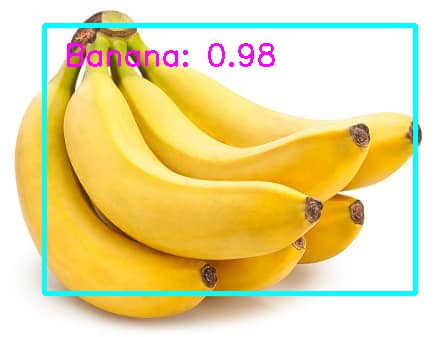
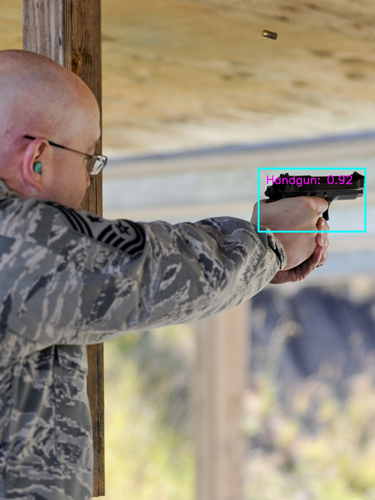

# Single Shot MultiBox Detector Implementation in Pytorch

This repo implements [SSD (Single Shot MultiBox Detector)](https://arxiv.org/abs/1512.02325). The implementation is heavily influenced by the projects [ssd.pytorch](https://github.com/amdegroot/ssd.pytorch) and [Detectron](https://github.com/facebookresearch/Detectron).
The design goal is modularity and extensibility.

Currently, it has mobilenet based SSD and VGG based SSD. 

It also has out-of-box support for retraining on Google Open Images dataset.



## Dependencies
1. Python 3.5+
2. OpenCV
3. Pytorch 0.4+
4. Caffe2
5. Pandas

## Run the demo
### Run the live Mobilenet SSD demo

```bash
wget -P models https://storage.googleapis.com/models-hao/mobilenet-v1-ssd-mp-0_675.pth
wget -P models https://storage.googleapis.com/models-hao/voc-model-labels.txt
python run_ssd_live_demo.py mb1-ssd models/mobilenet-v1-ssd-mp-0_675.pth models/voc-model-labels.txt 
```
### Run the live demo in Caffe2

```bash
wget -P models https://storage.googleapis.com/models-hao/mobilenet_v1_ssd_caffe2/mobilenet-v1-ssd_init_net.pb
wget -P models https://storage.googleapis.com/models-hao/mobilenet_v1_ssd_caffe2/mobilenet-v1-ssd_predict_net.pb
python run_ssd_live_caffe2.py models/mobilenet-v1-ssd_init_net.pb models/mobilenet-v1-ssd_predict_net.pb models/voc-model-labels.txt 
```

## Pretrained Models

### Mobilenet V1 SSD

URL: https://storage.googleapis.com/models-hao/mobilenet-v1-ssd-mp-0_675.pth

```
Average Precision Per-class:
aeroplane: 0.6742489426027927
bicycle: 0.7913672875238116
bird: 0.612096015101108
boat: 0.5616407126931772
bottle: 0.3471259064860268
bus: 0.7742298893362103
car: 0.7284171192326804
cat: 0.8360675520354323
chair: 0.5142295855384792
cow: 0.6244090341627014
diningtable: 0.7060035669312754
dog: 0.7849252606216821
horse: 0.8202146617282785
motorbike: 0.793578272243471
person: 0.7042670984734087
pottedplant: 0.40257147509774405
sheep: 0.6071252282334352
sofa: 0.7549120254763918
train: 0.8270992920206008
tvmonitor: 0.6459903029666852

Average Precision Across All Classes:0.6755
```

## Training

```bash
wget -P models https://storage.googleapis.com/models-hao/mobilenet_v1_with_relu_69_5.pth
python train_ssd.py --datasets ~/data/VOC0712/VOC2007/ ~/data/VOC0712/VOC2012/ --validation_dataset ~/data/VOC0712/test/VOC2007/ --net mb1-ssd --base_net models/mobilenet_v1_with_relu_69_5.pth  --batch_size 24 --num_epochs 200 --scheduler cosine --lr 0.01 --t_max 200
```


The dataset path is the parent directory of the folders: Annotations, ImageSets, JPEGImages, SegmentationClass and SegmentationObject. You can use multiple datasets to train.


## Evaluation

```bash
python eval_ssd.py --net mb1-ssd  --dataset ~/data/VOC0712/test/VOC2007/ --trained_model mobilenet-v1-ssd models/mobilenet-v1-ssd-mp-0_675.pth --label_file models/voc-model-labels.txt 
```

## Convert models to ONNX and Caffe2 models

```bash
python convert_to_caffe2_models.py mb1-ssd models/mobilenet-v1-ssd-mp-0_675.pth models/voc-model-labels.txt 
```

The converted models are models/mobilenet-v1-ssd.onnx, models/mobilenet-v1-ssd_init_net.pb and models/mobilenet-v1-ssd_predict_net.pb. The models in the format of pbtxt are also saved for reference.

## Retrain on Open Images Dataset

Let's we are building a model to detect guns for security purpose.

Before you start you can try the demo.

```bash
wget -P models https://storage.googleapis.com/models-hao/gun_model_2.21.pth
wget -P models https://storage.googleapis.com/models-hao/open-images-model-labels.txt
python run_ssd_example.py mb1-ssd models/gun_model_2.21.pth models/open-images-model-labels.txt ~/Downloads/big.JPG
```




If you manage to get more annotated data, the accuracy could become much higher.

### Download data

```bash
python open_images_downloader.py --root ~/data/open_images --class_names "Handgun,Shotgun" --num_workers 20
```

It will download data into the folder ~/data/open_images.

The content of the data directory looks as follows.

```
class-descriptions-boxable.csv       test                        validation
sub-test-annotations-bbox.csv        test-annotations-bbox.csv   validation-annotations-bbox.csv
sub-train-annotations-bbox.csv       train
sub-validation-annotations-bbox.csv  train-annotations-bbox.csv
```

The folders train, test, validation contain the images. The files like sub-train-annotations-bbox.csv 
is the annotation file.

### Retrain

```bash
python train_ssd.py --dataset_type open_images --datasets ~/data/open_images --net mb1-ssd --pretrained_ssd models/mobilenet-v1-ssd-mp-0_675.pth --scheduler cosine --lr 0.01 --t_max 100 --validation_epochs 5 --num_epochs 100 --base_net_lr 0.001  --batch_size 5
```

You can freeze the base net, or all the layers except the prediction heads. 

```
  --freeze_base_net     Freeze base net layers.
  --freeze_net          Freeze all the layers except the prediction head.
```

You can also use different learning rates 
for the base net, the extra layers and the prediction heads.

```
  --lr LR, --learning-rate LR
  --base_net_lr BASE_NET_LR
                        initial learning rate for base net.
  --extra_layers_lr EXTRA_LAYERS_LR
```

As subsets of open images data can be very unbalanced, it also provides
a handy option to roughly balance the data.

```
  --balance_data        Balance training data by down-sampling more frequent
                        labels.
```

### Test on image

```bash
python run_ssd_example.py mb1-ssd models/mobilenet-v1-ssd-Epoch-99-Loss-2.2184619531035423.pth models/open-images-model-labels.txt ~/Downloads/gun.JPG
```


## ONNX Friendly VGG16 SSD

The Scaled L2 Norm Layer has been replaced with BatchNorm to make the net ONNX compatible.

### Train

The pretrained based is borrowed from https://s3.amazonaws.com/amdegroot-models/vgg16_reducedfc.pth .

```bash
python train_ssd.py --datasets ~/data/VOC0712/VOC2007/ ~/data/VOC0712/VOC2012/ --validation_dataset ~/data/VOC0712/test/VOC2007/ --net "vgg16-ssd" --base_net models/vgg16_reducedfc.pth  --batch_size 24 --num_epochs 150 --scheduler cosine --lr 0.0012 --t_max 150 --validation_epochs 5
```

### Eval

```bash
python eval_ssd.py --net vgg16-ssd  --dataset ~/data/VOC0712/test/VOC2007/ --trained_model models/vgg16-ssd-Epoch-115-Loss-2.819455094383535.pth --label_file models/voc-model-labels.txt
```

## TODO

1. Resnet34 Based Model.
2. BatchNorm Fusion.
